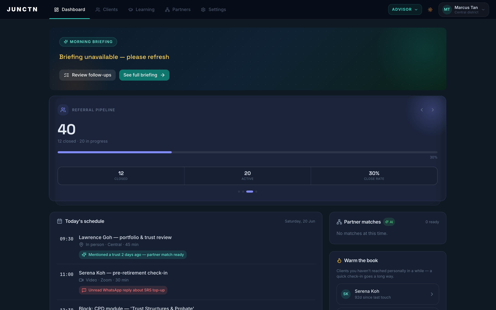
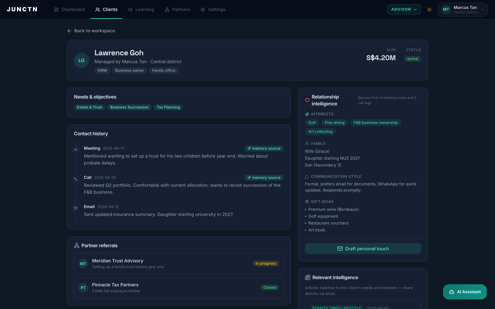
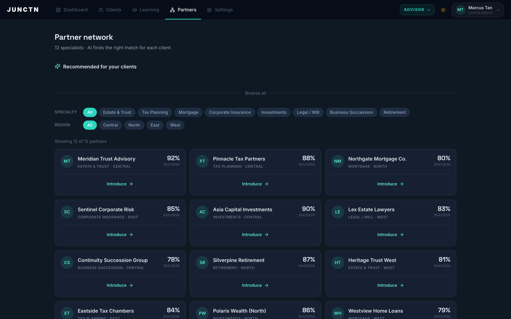
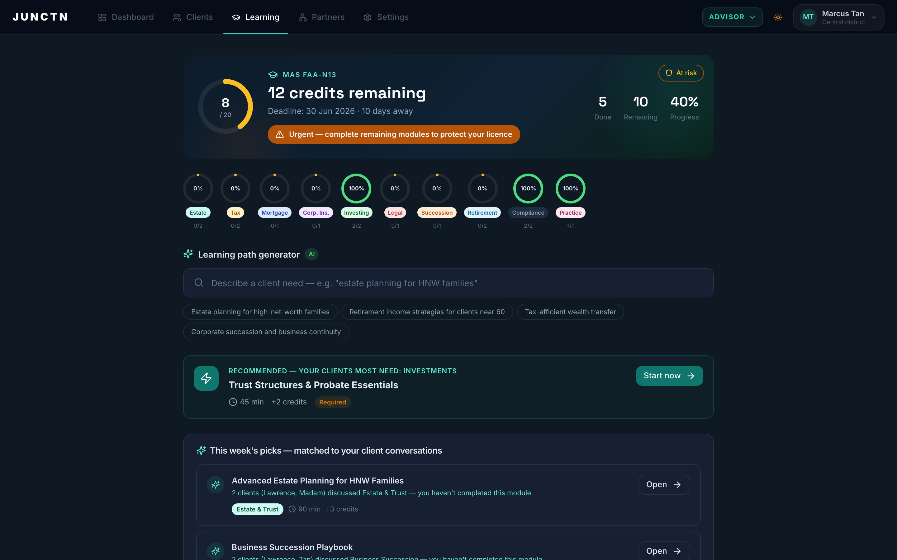
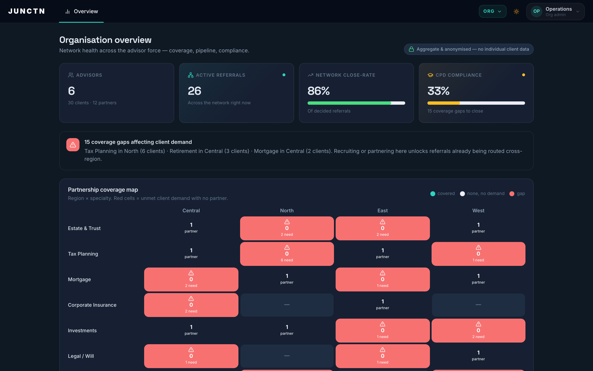

# JUNCTN

**The right connection, at the right moment.**

**Track 1 — ImagineHack 2026 · AAG × ASG**
Secure, Scalable, and Sustainable Advisory Platform

---

## What is JUNCTN?

JUNCTN is an AI-powered platform built for AAG's advisor force — not a productivity tool for one advisor having a better day, but a shared, organisation-wide platform where every feature reads from the same state.

Three modules — a **Morning Briefing agent**, a **CPD compliance engine**, and a **Partner-matching engine** — all run on a single **Advisor Context Layer**, behind one security boundary. A Telegram bot sits on top as a lightweight notification and input channel that reuses the exact same backend.

The web app is the full product. The Telegram bot is the moment that makes the platform story click: *same context layer, different front door.*

---

## Team

**Team Gunners**

Member 
- *Lau Hiap Meng*
- *Loh Yong Qiao*
- *Tai Jin Wei*
- *Felicia Sia Xin Rou*

---

## Challenge & Approach

### The challenge (Track 1 · AAG × ASG)

AAG and ASG operate in a fast-changing advisory landscape where advisors must manage **client relationships, continuous learning, and a broad partner ecosystem** with consistency and care. The brief asks for a solution that goes beyond one-off productivity tools and instead creates an **organisation-wide capability** that supports advisors **securely, at scale, and over time**.

The core problem: advisors are forced to act as **manual routers** between fragmented systems — client follow-ups live in one tool, learning in another, and the right partner surfaces only if an advisor happens to remember their name. This is an *infrastructure* gap, not a feature gap.

### Our approach

We answered the gap with **infrastructure, not more features**. Everything is built on one **Advisor Context Layer** — a per-advisor state store that every module reads from and writes to. That single decision is what lets a follow-up logged this morning inform a CPD nudge and a partner match by the afternoon.

Our three modules map **1:1 onto the track's three expected outcomes**:

| Track 1 expected outcome | JUNCTN module |
|---|---|
| Advisor productivity & client attention (calendars, client memory, briefings, follow-ups) | **Morning Briefing Agent** |
| Living learning & development library (searchable, CPD tracking) | **CPD Compliance Engine** |
| Partnership ecosystem visibility (right partner at the right moment, referral tracking) | **Partner Matching** |

Two principles are enforced on every screen:
1. **Show the AI working** — no blank spinners; streaming text, skeleton loaders, and a live agent-trace panel.
2. **Always show why** — every recommendation carries one line of reasoning (*"Recommended because…"*, *"Matched because…"*).

---

## Core Features

### 1. Morning Briefing Agent
Every morning an advisor opens JUNCTN and within seconds sees who needs attention, what's on the calendar, and which follow-ups have been neglected — pulled from live sources and synthesised into one briefing card.

Built as a **LangGraph multi-agent pipeline**:

| Agent | Job |
|---|---|
| Planner (orchestrator) | Entry point; emits the first trace event so the UI lights up instantly |
| Calendar subagent | Pulls today's meetings, flags meetings missing notes |
| Client memory subagent | Reads the Context Layer per meeting-client and asks Gemini for a structured assessment (open threads, relationship health, a talking point) |
| Follow-up subagent | Scans active clients for overdue touchpoints and unanswered replies |
| Synthesiser | Merges all agent output into a structured briefing, **streamed token-by-token** over SSE |

The UI shows a **live agent-trace panel** — advisors (and judges) watch each subagent complete in real time, and the briefing streams section by section rather than appearing behind a spinner.

### 2. CPD Compliance Engine
CPD isn't just a learning library — it's a **licensing risk**. Missing credits means regulatory exposure, not a missed class.

- **Learning-path generator** — an advisor types a plain-language client need and gets the most relevant CPD modules ranked by embedding similarity (sentence-transformers + cosine).
- **Weekly picks** — modules surfaced from what the advisor's clients are actually discussing this week (*"2 clients discussed Estate & Trust"*).
- **CPD dashboard** — credits earned vs. required, per-category progress rings, and deadline status.
- **Org-level view** — every advisor's CPD compliance in one screen.

### 3. Partner Matching
One unforgettable demo moment. In a client conversation view, the client mentions *"setting up a family trust."* JUNCTN detects the topic via **embedding similarity** (not hardcoded keywords) and a partner card slides in — *Meridian Trust Advisory — Estate & Trust* — with one button: **Introduce**.

- Referral lifecycle: Suggested → Introduced → In progress → Closed.
- **Advisor approval required** before any partner is contacted — the security boundary is enforced, not just claimed.
- Partner contact details are **never sent to the AI**; matching runs on specialty and region only.

### Telegram Bot
Same Context Layer, same backend, different front door — proof that this is a platform, not four separate apps.

| Command / trigger | What happens |
|---|---|
| `/briefing` | Today's top priorities as a short message |
| Scheduled push | Proactively sends the morning briefing |
| `/followups` | Lists clients needing a nudge with an inline "Mark contacted" button |
| Inline approval | "Approve introduction" — the same approval step as the web app, from a phone |

---

## Technologies Used

### Frontend
| | |
|---|---|
| Framework | Next.js 14 (App Router) |
| Language | TypeScript |
| Styling | Tailwind CSS, CSS custom properties for design tokens |
| UI components | Radix UI (Dialog, Avatar, Progress, Tabs) |
| Icons | Lucide React |
| Charts | Recharts |
| State | React Context store |

### Backend
| | |
|---|---|
| Framework | FastAPI |
| Language | Python 3.12 |
| AI orchestration | LangGraph (multi-agent pipeline) |
| LLM | Google Gemini API (`google-generativeai`) |
| Embeddings | `sentence-transformers` — `all-MiniLM-L6-v2` |
| Vector / similarity | NumPy cosine similarity (partner & CPD matching) |
| Auth | JWT (`python-jose`) |
| Streaming | Server-Sent Events (`sse-starlette`) |
| HTTP client | HTTPX |

### Infrastructure & data
- Per-advisor **Advisor Context Layer** as the shared state every module reads
- **Audit log** — every LLM call records timestamp, advisor, feature, and token counts
- Seeded demo data for advisors, clients, partners, referrals, and CPD modules

> See [SystemArchitecture.md](SystemArchitecture.md) for the full Morning Briefing pipeline architecture and security boundaries.

---

## Security

- Every API call validates the advisor's **JWT** before touching any data — Advisor A's context is unreachable by Advisor B.
- Every AI action is **logged** (timestamp, advisor, feature, outcome) and visible as an audit table.
- **Partner contact info never enters the AI layer** — matching runs on specialty and region only.

---

## Usage Instructions

### Prerequisites
- Node.js 18+
- Python 3.12

### Backend

```bash
cd backend
python3.12 -m venv venv
source venv/bin/activate
pip install -r requirements.txt
```

Copy the environment file and fill in your keys:

```bash
cp .env.example .env
```

Required environment variables:

```env
GEMINI_API_KEY=your_gemini_api_key
JWT_SECRET=your_jwt_secret
CORS_ORIGIN=http://localhost:3000
```

Start the backend:

```bash
uvicorn backend.main:app --reload --port 8000
```

API runs on [http://localhost:8000](http://localhost:8000). Health check: `GET /health`.

### Frontend

```bash
cd frontend
npm install
npm run dev
```

Runs on [http://localhost:3000](http://localhost:3000).

### Running the tests

```bash
pytest                       # backend (Python)
cd tests/frontend && npm test  # frontend (Jest)
```

---

## Demo

> 📹 **Video demo:** *(paste link — YouTube / Loom / Drive)*

### Screenshots

**Advisor dashboard** — morning briefing, today's schedule, partner matches, and the "warm the book" queue.


**Relationship intelligence** — a per-client profile (interests, family, gift ideas) with a one-tap "Draft personal touch", plus news matched to the client's interests. Every field shows where it came from.


**Partner matching** — the partner network with AI-recommended specialists, filterable by specialty and region, each with a success rate and a one-click Introduce.


**CPD / Learning** — credits and deadline status, a learning-path generator, and weekly picks matched to what the advisor's clients are actually discussing.


**Organisation overview** — network-wide coverage, referral pipeline, CPD compliance, and a partnership coverage-gap heatmap (aggregate and anonymised).


**Suggested 60-second flow to record:** open the advisor dashboard → watch the briefing stream with the live agent trace → open a client who mentions a trust → the partner card slides in → approve the introduction → show the same briefing arriving in Telegram.

---

## Design System

Dark-first — "Bloomberg Terminal meets fintech." Dense and authoritative, not soft-SaaS.

| Token | Value | Usage |
|---|---|---|
| Background | `#0D1117` | Page background |
| Surface | `#161B22` | Cards, panels |
| Accent (teal) | `#1D9E75` | Primary actions, active states |
| Alert (amber) | `#BA7517` | Follow-ups, CPD warnings |
| Learning (purple) | `#7F77DD` | CPD / L&D elements |
| Text | `#E2E8F0` | Primary text |

---

## The Platform Story

> "Everything you've just seen — the briefing, the CPD recommendation, the partner match — all read from the same Advisor Context Layer. The Telegram bot reads from that exact same layer too. That's what makes this a platform, not four separate features."

---

*Built for ImagineHack 2026 · Track 1 · AAG × ASG · by Team Gunners.*
